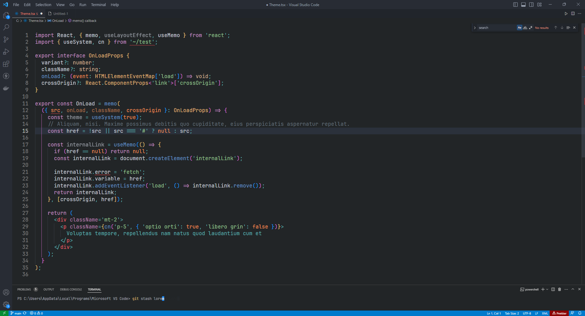

# Ano Theme for [Visual Studio Code](http://code.visualstudio.com)

> A dark theme for [Visual Studio Code](http://code.visualstudio.com).

## Install

1. Go to VS Marketplace.
2. Click on the "Install" button.
3. Then [select a theme](https://code.visualstudio.com/docs/getstarted/themes#_selecting-the-color-theme).

### Supporting

	Like this free project? Consider supporting me to keep going.

&nbsp;&emsp;&nbsp;

## License

[MIT License](./LICENSE) © Ano Theme
